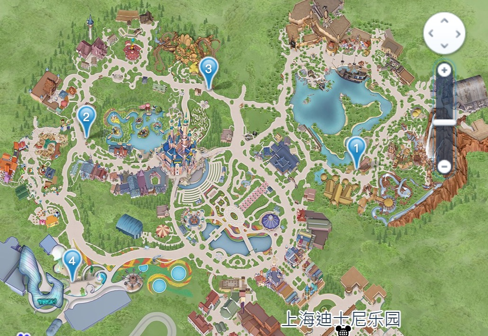
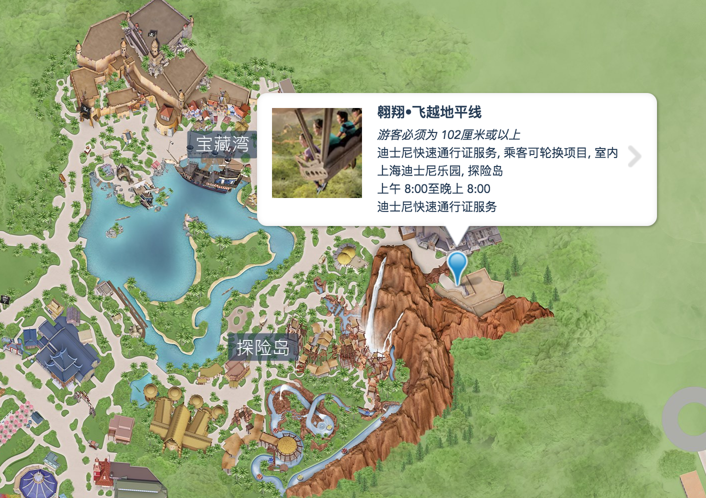
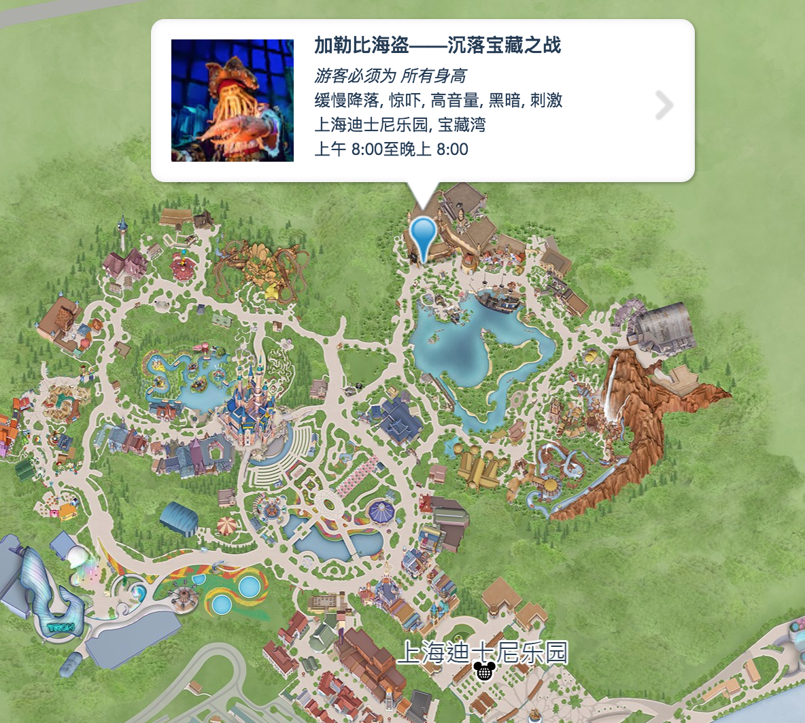
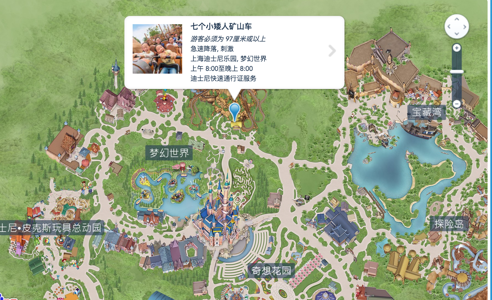
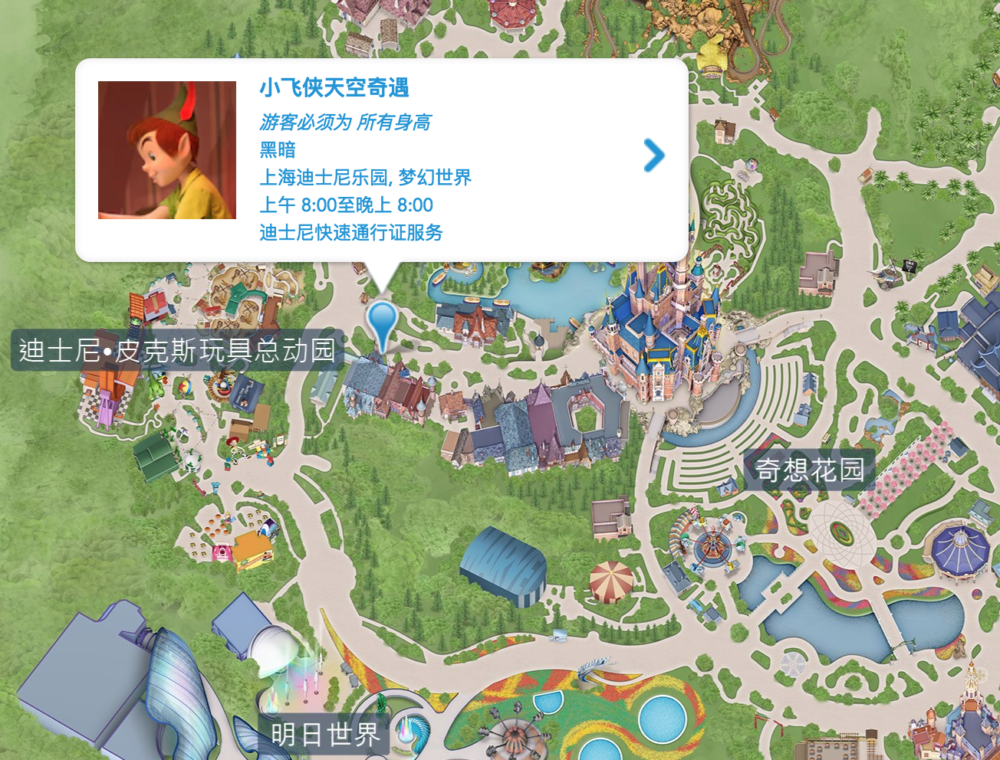
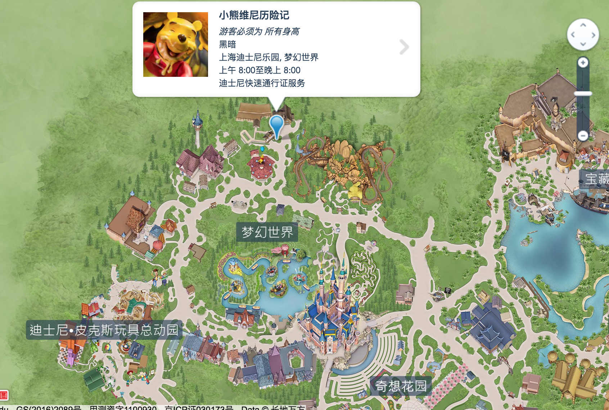

# 预备

先扫码下软件：一定要提前下！！可以提前了解里面的情况和排队情况，更重要的是，**现在FP可以在手机上领取了（[FP攻略](#FP攻略)）**， 查看在线领取FP[使用说明](https://mp.weixin.qq.com/s?__biz=MzU0NzEwNTkyMQ==&mid=2247484484&idx=1&sn=a41f898a4a98d90021e2e1ec0dbd3ff9&chksm=fb5239aacc25b0bce3565d0650dba5cc0b33f4b52c9c3501a1bb06a57aa36539a8f0f7b5e63e&scene=21#wechat_redirect)

用ＡＰＰ，可以明天看看排队情况，一般排队多的就是比较火的项目（`地平线`，漂流，速光轮，`矿车`……）其中标红的是建议玩的，下面也有说明。

先大概了解迪斯尼地图，主要是以下几个区，现在新增了`玩具总动员区`，在梦想时间和明日世界中间。

## 入园注意篇

1. 该带什么进园 

    ①身份证。这个很重要，因为取票是要身份证取的，千万别忘了。

    ②雨衣。不管是突然遭遇下雨天还是玩会湿身的雷鸣山漂流都非常有用。

    ③充电宝。可以随时保持电力拍拍拍，排队无聊的时候还能毫无顾忌地玩手机。

    ④轻便的鞋。这么童真的地方就暂时告别恨天高吧，还是来一双方便走路的鞋，可以毫无顾忌地在园区内跑跑跳跳一整天也不累。

 2.不该带什么进园

 	①最新消息，禁止携带：食品、酒精饮料、超过600毫升的非酒精饮料等！

​	②自拍杆和折叠板凳。这是被迪士尼禁止带入园区的，带了也进不去，还是别带了。

​	③其他可能被限制的物品（具体以景区当天公布为准）。

# 演出项目

1. #### **风暴来临：杰克船长之惊天特技大冒险 （宝藏湾）**

   **演出时间**：

   上午 10:40, 上午 11:20, 上午 11:50, 下午 1:00, 下午 1:40, 下午 2:20, 下午 3:00, 下午 4:30

1. #### 冰雪奇缘：欢唱盛会（梦幻世界）

   **演出时间**

   上午 10:45, 上午 11:30, 下午 12:15, 下午 1:15, 下午 2:00, 下午 2:45, 下午 3:45, 下午 4:30

  

1. #### **米奇童话专列（巡游）**

   **演出时间**

   下午 12:00

   

2. #### **人猿泰山：丛林的呼唤（探险岛）**

   **演出时间**

   下午 12:30, 下午 1:30, 下午 2:45, 下午 4:00

 

1. #### **点亮奇梦：夜光幻影秀（主楼正面）**

   **演出时间**

   晚上 8:00

# FP攻略

每2小时拿一张FP，一天一共能拿三张FP，由于不玩刺激项目。推荐``飞跃地平线``，`矿车`，`小飞侠`(下面标了优先级)   飞跃地平线是必须必须要拿FP玩的，不然随便排队4+小时。

- [创极速光轮——明日世界主题园区](https://www.shanghaidisneyresort.com/attractions/tron-lightcycle-power-run/)
- [巴斯光年星际营救——明日世界主题园区](https://www.shanghaidisneyresort.com/attractions/buzz-lightyear-planet-rescue/)
- [七个小矮人矿山车——梦幻世界主题园区](https://www.shanghaidisneyresort.com/attractions/seven-dwarfs-mine-train/) 2
- [小熊维尼历险记——梦幻世界主题园区](https://www.shanghaidisneyresort.com/attractions/adventures-winnie-pooh/) 
- [小飞侠天空奇遇——梦幻世界主题园区](https://www.shanghaidisneyresort.com/attractions/peter-pans-flight/)  3
- [雷鸣山漂流——探险岛主题园区](https://www.shanghaidisneyresort.com/attractions/roaring-rapids/)
- [翱翔•飞越地平线——探险岛主题园区](https://www.shanghaidisneyresort.com/attractions/soaring-over-horizon/) 1

预约时间尽量错开几小时，方便自己这段时间排队玩别的（**如果拿了地平线的FP，就赶紧去排队加勒比海盗**）

有人说手机APP抢尽早的可以不用等2小时，有待确认

> 首先，入园后，尽可能领时间早的FP。因为抢FP的使用时间段越早，你能够越早领下一张FP，不一定要2个小时哦⊙∀⊙！！例如，我们入园8点10分左右排队飞跃地平线，同时抢的第一张FP是9.25-10.25的七个小矮人，app就会提示我们下一次领FP的时间是8.45分。8.45分到的时候，并不能马上领。但是，不要放弃，8.46-47分左右基本就可以领啦！！所以，这里的重点是抢的FP使用时间段越早越好，大家注意时间哟！！

如果不用APP拿FP，那就注意：一般来说进园去探险岛拿FP，但是所有人都这么想，所以人会很多，所以当所有人都去探险的岛的时候，**可以直接走直线去梦想世界拿FP。**因为每2小时只能拿1张，所以一定要计算好时间，别浪费。尽量先拿**地平线，矿车**，这个下午可能就没了。 

## 

# 娱乐项目

推荐线路：

- 入园拿`地平线`FP预约（>=4小时）
- 然后跑去看[矿车](#七个小矮人矿山车)排队人多不多，预计2小时内就排排，如果人太多就去排[加勒比](加勒比海盗)（因为矿车还有可能2小时后可以预约，实在预约不到就算了）
- 根据时间等演出
- 如果快12点就等巡游
- 领下一张FP（[矿车](#七个小矮人矿山车) / [小飞侠天空奇遇](#小飞侠天空奇遇) )
- 用FP玩[地平线](翱翔•飞越地平线)
- 然后根据喜好排一个项目或者去看演出
- 根据时间领最后一张FP（有啥玩啥）
- 用FP玩（[矿车](#七个小矮人矿山车) / [小飞侠天空奇遇](#小飞侠天空奇遇) )
- 看演出（冰雪或泰山）

6点半-7点左右就要去占位置看晚上的演出了，尽量靠前，这样拍摄效果好

## 探险岛

漂流容易湿身，而且太刺激就别玩了，这里推荐：

### 翱翔•飞越地平线

`FP`王牌项目，必玩。通过FP玩，不要排队 

座位坐3星以上的就行

## 宝藏湾

### 加勒比海盗

建议必玩，超级精彩，没有FP，需要排队。

玩完根据时间顺便在旁边等演出“[风暴来临：杰克船长之惊天特技大冒险](https://www.shanghaidisneyresort.com/entertainment/theme-park/eye-of-storm-captain-jacks-spectacular/)”

上午 10:40, 上午 11:20, 上午 11:50, 下午 1:00, 下午 1:40, 下午 2:20, 下午 3:00, 下午 4:30

**注意好时间，别忘了拿FP**

## 梦想世界

### 七个小矮人矿山车

`FP `，建议必玩

### 小飞侠天空奇遇

`FP`，缓慢过山浏览类

### 小熊维尼历险记

（可选）

玩完根据时间顺便在旁边等演出“[冰雪奇缘：欢唱盛会](https://www.shanghaidisneyresort.com/entertainment/theme-park/frozen-sing-along-celebration/)”

上午 10:45, 上午 11:30, 下午 12:15, 下午 1:15, 下午 2:00, 下午 2:45, 下午 3:45, 下午 4:30

**注意好时间，别忘了拿FP**

## 明日世界

明日世界的东西女生一般不太喜欢，可以看看创界或者单人背部飞行器。略过

## 迪士尼·皮克斯玩具总动员

新园区没玩过，可以去尝试一下，前提地平线一定要玩，矿车尽量玩。

## 奇想花园

主要是拍照，如果想玩，可以玩旋转木马和小飞象（以之前的主流项目玩完为主）
